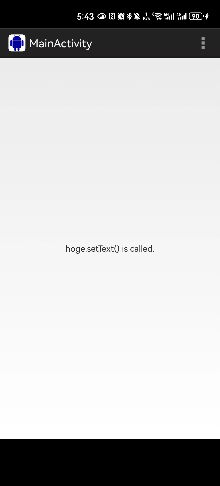

## 原来的项目不维护了，这是我拉下来，配置了gralde。目前看来还是可以运行的(2024年3月1日）

运行效果

这是以前项目的内容

 [原来项目地址javassist-android](https://github.com/crimsonwoods/javassist-android)
====
NOT MAINTAINED!
====

This project is obsolete.
Do not use.

Javassist-Android
==================
Javassist for Android

Extended Javassist for Android.
DEX (ODEX) file can be made from ".class" file that is generated by Javassist.

Contained Projects
------
- dx : 
  original source is contained into Android source code tree.
- javassist-android :
  A library project for Android
- javassistSample : 
  Sample application

Link
------
- [Javassist](http://www.javassist.org/)
- [Dx](https://android.googlesource.com/platform/dalvik/+/refs/heads/jb-release/dx/)

